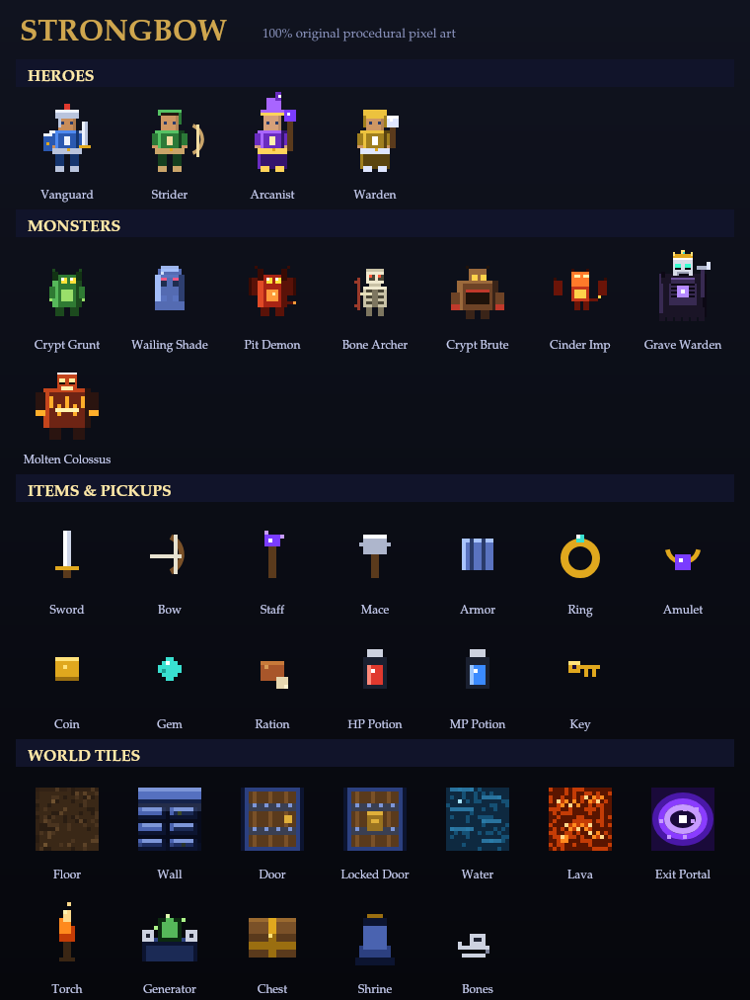

# StrongBow

A browser-based, top-down arcade dungeon crawler with **100% procedural pixel
art** and an **epic procedural soundtrack** — built with Phaser 4 + TypeScript +
Vite. All original art and audio.



## Quick start

```bash
npm install
npm run dev        # game on http://localhost:5173 + AI proxy on :3847
```

Open the URL, click **1 Player** or **2 Players**, pick a hero, and descend.
Click once on the page to enable audio (browser autoplay policy).

### Commands
```bash
npm run dev          # game + AI proxy together
npm run dev:client   # game only (Vite)
npm run dev:server   # AI proxy only
npm run dev:kill     # free ports 3847 / 5173-5175
npm run build        # type-check (tsc) + production build to dist/
npm run preview      # serve the production build
```

## Controls (all rebindable in Settings -> Controls)

| | Player 1 | Player 2 |
|---|---|---|
| Move | W A S D | Arrow keys |
| Attack (hold) | Z | / |
| Magic | Q | Enter |
| Use / interact | E | Right Shift |
| Character sheet | P | ; |
| Inventory | I / Tab | M |
| Growth | K | \ |

Global: **O** settings - **H** manual - **F2** quick-save - **2** add Player 2 -
**Esc** close menu / quit. Game over: **C** continue / **M** quit.

Camera zoom is fixed for a consistent arcade frame (no slider).

## The descent: two levels

Fight down through two hand-tuned procedural levels:

1. **The Sunken Crypt** (120x84) — flooded catacombs of the restless dead, ruled
   by the **Grave Warden**.
2. **The Molten Deep** (132x96) — a sprawling magma cavern guarded by the
   **Molten Colossus**.

Clear a level's objective and step on its exit portal to **descend to the next
level with your whole party's levels, skills, attributes, gold, and gear intact**.
Survive the Molten Deep for the true victory.

### How to win a level

Destroy at least **3 generators**, slay the level **boss**, then step on the
**exit portal**. Find the **key** to open the locked door guarding the boss. Lava
burns over time but never traps you — keep moving and walk out.

## Bestiary

Six foes plus two bosses, each with distinct behaviour:

- **Crypt Grunt / Wailing Shade / Pit Demon** — melee swarmers of increasing menace.
- **Bone Archer** — keeps its distance and looses arrows; close the gap fast.
- **Crypt Brute** — armoured bruiser that telegraphs, then **charges**.
- **Cinder Imp** — tiny, fast, and deadly in swarms.
- **Grave Warden / Molten Colossus** (bosses) — cycle telegraphed attack
  patterns as their health drops: a **radial volley**, **summoning**
  reinforcements, and a close-range **flame nova**. Watch for the wind-up flash.

## Progression

- Kills grant XP (shared a little with the whole party). Each level gives a
  **skill point** and an **attribute point**.
- **Growth (K):** raise class skills (1-3) and attributes Might / Vitality / Focus (4-6).
- **Inventory (I):** equip backpack gear (1-9), unequip (Up/Down + U), drink a potion (C). Bonuses apply instantly.
- **Character sheet (P):** full stats, growth, and equipped gear.
- **Every pickup announces itself** — gold, rations, potions, keys, and gear show
  a floating label so you always know what you grabbed.
- Solo play gives 3 AI companions; co-op gives 2. They follow the active player,
  **path intelligently around corners**, and fight; tune them in Settings -> Companions.

## Save & restore

- Press **F2** in the dungeon to quick-save your run (party, inventory, world
  progress, and current level) to the browser.
- A **CONTINUE** button appears on the title screen whenever a save exists; it
  drops you straight back into the saved level with your party restored.

## In-game manual

Press **H** on the title screen or in the dungeon (or Settings -> Manual) for a
Nintendo-style manual: story, controls, growth guide, AI setup, a dossier for
each hero class, and an illustrated bestiary + armory.

## Epic audio (optional real tracks)

The soundtrack and SFX are synthesized live via the Web Audio API — layered
dungeon and boss themes, no files required. Drop `theme.mp3` / `boss.mp3` /
`menu.mp3` into `public/audio/` to override with real tracks (no code change).

## Optional: AI narration

Quests and narrator barks can be generated by an LLM (OpenAI / Anthropic / xAI).
Without keys, built-in text is used, so everything works offline. Copy
`.env.example` to `.env`, set a provider + server-side key, then `npm run dev`.
The title screen shows a green indicator when the proxy + provider are reachable.

> Security note: keep real API keys in `.env` (git-ignored), not in
> `.env.example`, which is committed.

## Project structure

See `PROJECT_OVERVIEW.md` for the full architecture. Key folders: `src/core`
(constants, types, settings, KeyBindings), `src/rendering` (procedural art),
`src/systems` (audio, stats, skills, attributes, input, companion AI,
pathfinding, save), `src/entities`, `src/scenes`, `src/ui`, `src/data`
(levels + content), `src/ai`, `server/`.
